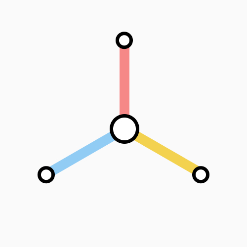

<div align="center">
  <a href="https://swarms.world">
    
  </a>
</div>
<p align="center">
  <em>optimize deliver accelerate simplify</em>
</p>

<p align="center">
<a href="https://x.com/mymetro_dot_io">Twitter</a>
<span>&nbsp;&nbsp;•&nbsp;&nbsp;</span>
<a href="https://www.mymetro.io/">Site</a>
<span>&nbsp;&nbsp;•&nbsp;&nbsp;</span>
<a href="https://docs.mymetro.io/">Documentation</a>
</p>


# metrolib

**metrolib** is a Python library that models a metro (subway) system using AI-driven station generation, clustering, and route-finding. All station data is produced by a neural network (or other AI methods), allowing for flexible and fully automated map creation.
This repository implements AI and Ant Colony Optimization algorithms to optimize transport routes through dynamic simulations.


## Table of Contents

1. [Features](#features)  
2. [Installation](#installation)  
3. [Core AI Concepts](#core-ai-concepts)  
   - [AI-Generated Stations](#ai-generated-stations)  
   - [Station Clustering](#station-clustering)  
   - [Graph Construction & Route-Finding](#graph-construction--route-finding)  
4. [API Overview](#api-overview)  
5. [Advanced Usage](#advanced-usage)  
6. [Roadmap](#roadmap)  
---

## Features

- **AI-Generated Metro Data**  
  All metro stations, lines, and relevant metadata can be produced by a neural network or other AI method, resulting in unique and dynamic maps.

- **Clustering & Graph Construction**  
  Clusters nearby stations for optimized route planning, then builds a network (graph) to handle pathfinding.

- **Flexible Route-Finding Engine**  
  Uses various strategies (random exploration, BFS/DFS-like algorithms, or custom approaches) to traverse the AI-generated map.

- **Self-Recovery from Dead Ends**  
  If the train encounters a dead-end station, the engine can automatically restart or pick alternative routes.

- **Minimal Dependencies & Easy Integration**  
  Written in Python, using straightforward data structures and classes.

---

## Installation

You can install the package with `pip` from [pypi](https://pypi.org/project/swarmlib).
Installing the library in a virtual environment is recommended:

```zsh
# Create virtual environment
python3 -m venv .venv
source .venv/bin/activate

# Install the latest version of swarmlib
pip install --upgrade swarmlib

# Verify installation
swarm --version
```

## Core AI Concepts

### AI-Generated Stations
- **metrolib** expects station data (coordinates, IDs, lines, etc.) to come from an AI model or generator.  
- This allows dynamic or procedural creation of new maps without manual configuration.

### Station Clustering
- Each station is treated as a point \((x, y)\).
- A threshold-based algorithm groups stations that are closer than a specified distance.
- Clustering helps manage large, AI-produced station sets by reducing complexity.

### Graph Construction & Route-Finding
- After clustering, the library generates a **graph** of stations (nodes) and connections (edges).
- Route-finding can be randomized or deterministic:
  - Defaults to random exploration of unvisited neighbors.
  - Can be overridden to implement BFS, DFS, or custom path logic.
- The system can handle **dead ends** by restarting or picking alternative paths.

---

## API Overview

- **`cluster_stations(lines: list, threshold: float) -> list`**  
  Groups stations based on proximity.

- **`build_graph(lines: list, clusters: list) -> dict`**  
  Constructs a graph where keys are station IDs, and values include station details + neighbors.

- **`MetroMap(graph: dict)`**  
  Encapsulates station graph and relevant route-finding utilities.

- **`start_simulation(metro_map: MetroMap, start_id: str, end_id: str) -> SimulationResult`**  
  Initiates train movement from `start_id` to `end_id` within the AI-generated map.

- **`SimulationResult`**  
  - `route`: list of visited station IDs  
  - `logs` (optional): any textual logs of the route  

---

## Advanced Usage

1. **Custom Route Selection**  
   Override the neighbor selection logic to implement your own BFS/DFS, or integrate with advanced AI decisions.

2. **Integration With Larger Systems**  
   Embedding **metrolib** into a GUI, a simulation platform, or a data pipeline is straightforward. The library is lightweight and easily extended.

3. **Adaptive Thresholding**  
   Adjust clustering thresholds dynamically based on AI-generated station density or other metrics.

---

## Roadmap

- **Weighted Paths**  
  Incorporate distances or custom costs for edges, enabling more realistic route selection.

- **Enhanced Clustering**  
  Evaluate advanced algorithms (DBSCAN, k-means) if threshold-based solutions are insufficient.

- **AI Integration**  
  - Integrate advanced route selection (e.g., reinforcement learning).  
  - Refine station generation with different neural models or generative adversarial networks.